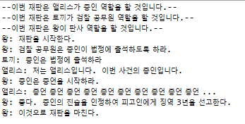

1. 재판(trial)의 협력 모델을 먼저 설계한다.
2. 재판의 목적: 피고인의 유죄 여부를 가린다. (형량 등의 자세한 사항들은 단순함을 위해 제외)
3. 처음 생각해보는 재판에 필요한 기본적인 메시지
	1. 재판하라
	2. 목격자를 불러오라
	3. 증인석에 입장하라
	4. 증언하라
4. 위에서 만들어놓은 메시지(요청과 응답의 흐름)가 책임이 된다.
5. 책임을 수행할 역할을 정의한다 - 역할은 책임의 집합이다.
	1. 판사 역할
		1. '재판하라'의 응답
		2. '목격자를 불러오라'의 요청
		3. '증언하라'의 요청
	2. 검찰 공무원(?) 역할
		1. '목격자를 불러오라'의 응답
		2. '증인석에 입장하라'의 요청
	3. 증인의 역할
		1. '증인석에 입장하라'의 응답
		2. '증언하라'의 응답
6. 역할의 추상화가 완료되었으므로 실제 수행할 객체를 생성한다.
7. 다만 본인은 인터페이스를 사용하여 역할을 명확하게 먼저 정의하겠다.
8. 여기서 주의할 점: 아는 것 vs 하는 것 - 이 둘은 책임을 구성한다.
9. 아는 것
	1. 개인적인 정보에 관해 아는 것
	2. 관련된 객체에 관해 아는 것
	3. 자신이 유도하거나 계산할 수 있는 것에 관해 아는 것
10. 하는 것
	1. 객체를 생성하거나 계산을 하는 등의 스스로 하는 것
	2. 다른 객체의 행동을 시작시키는 것
	3. 다른 객체의 활동을 제어하고 조절하는 것
11. '아는 것'은 인터페이스로 추상화할 수 없는 것 같다. (예: 다른 객체에게 요청할 메시지)
12. 실행 결과
	
